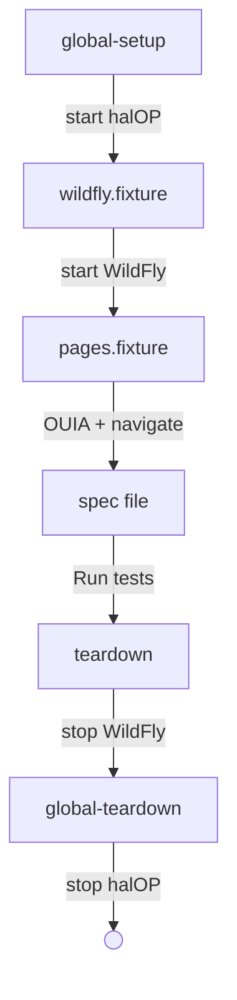
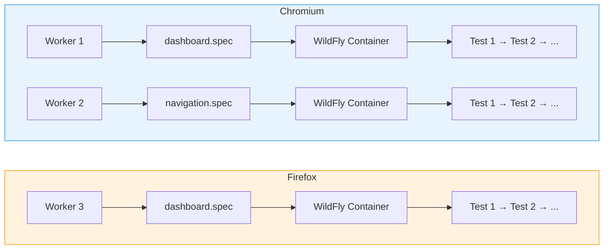

# Architecture

## Test Lifecycle

The test lifecycle is bookended by global setup and teardown. Global setup starts the shared halOP container once, then each Playwright worker starts its own WildFly container via a worker-scoped fixture. Page objects are created per test, and everything tears down in reverse order when tests complete.



Spec files run **in parallel** across multiple workers (4 locally, 2 in CI). Tests within a spec file are sequential.
Each test file gets its own isolated WildFly container per browser project via a worker-scoped Playwright fixture
backed by [testcontainers](https://node.testcontainers.org/). Tests run in Chromium, Firefox, and WebKit.

For a detailed walkthrough of the four fixture layers, see [Fixtures](./fixtures.md).

## Parallelism and Container Instances

The simple rule is: **each spec file gets its own WildFly container
**. Two spec files never share a container, and tests within the same spec file always share one.

This works because Playwright assigns each spec file to a **worker** (an OS process), and the WildFly container is created by a
**worker-scoped fixture
** — a Playwright mechanism that ties the container's lifetime to the worker. Since each worker runs exactly one spec file, the mapping is always 1:1:1:

> **one worker = one spec file = one WildFly container**

The _fixture_ is the code that starts and stops the container (defined in `wildfly.fixture.ts`). The
_container_ is the actual Docker/Podman instance running WildFly. There's always exactly one container per fixture instance, so in practice the terms refer to the same thing — but "container" is what matters to test authors.

Playwright runs three browser projects (Chromium, Firefox, WebKit). Each project runs every spec file independently, so the same spec gets a separate container in each browser:



| Concept                 | Relationship                                                                                                          |
| ----------------------- | --------------------------------------------------------------------------------------------------------------------- |
| **Spec file**           | Gets its own dedicated WildFly container — full isolation between specs                                               |
| **Worker**              | Runs one spec file; owns one WildFly container for its lifetime                                                       |
| **Browser project**     | Each spec runs independently per browser, so the same spec gets a separate container in Chromium, Firefox, and WebKit |
| **Parallelism**         | Up to `workers` spec files run simultaneously per browser project (4 local, 2 CI)                                     |
| **Tests within a spec** | Run sequentially (`fullyParallel: false`), sharing that spec's WildFly container                                      |

**Total WildFly containers** at peak =
`min(workers, spec_count)` per browser project. With 10 spec files and 4 workers running Chromium, at most 4 containers run concurrently for Chromium; finished workers pick up the next spec file.

The container lifecycle: started before the first test in a worker, shared by all tests in that spec file, stopped after the last test finishes.

## WildFly Container Fixture

WildFly containers are managed by a **worker-scoped Playwright fixture** defined in [
`src/fixtures/wildfly.fixture.ts`](https://github.com/hal/dave/blob/main/src/fixtures/wildfly.fixture.ts). Spec files that need WildFly and page objects import
`test` from `pages.fixture.ts` and declare their spec path:

```typescript
import { test, expect } from "../../fixtures/pages.fixture.js";

test.use({ specPath: "smoke/dashboard" });
```

The fixture starts a container before any test in the worker runs and stops it after the last test finishes. Container names follow the pattern
`dave_<path>_<project>` (e.g., `dave_smoke_dashboard_chromium`). Ports are dynamically allocated.

Spec files that don't need WildFly (e.g., `app-loads.spec.ts`) import `test` and `expect` from `wildfly.fixture.ts`.

## Page Object Model

Custom Playwright fixtures in [
`src/fixtures/pages.fixture.ts`](https://github.com/hal/dave/blob/main/src/fixtures/pages.fixture.ts) provide page objects to each test. Page objects are pure UI concerns (locators and actions) — they don't know about WildFly URLs or infrastructure. The fixture layer handles navigation via
`openHalOp(page, managementUrl)` before handing each page object to the test, so tests receive ready-to-use pages:

| Fixture             | Purpose                                                                   |
| ------------------- | ------------------------------------------------------------------------- |
| `basePage`          | Base page with shared `page` accessor                                     |
| `configurationPage` | Configuration finder tree (Subsystems, Interfaces, Socket Bindings, etc.) |
| `dashboardPage`     | Dashboard sections (overview, host, JVM, memory, log, links)              |
| `modelBrowserPage`  | Model browser tree, toolbar, tabs, and resource assertions                |
| `navigationPage`    | Sidebar navigation (Dashboard, Deployments, Configuration, Runtime, etc.) |
| `tasksPage`         | Task cards (Data source, Logging, Management SSL, etc.)                   |

Tests import `test` and `expect` from `../fixtures/pages.fixture` instead of `@playwright/test`.

## Element Identification

Tests use [OUIA](https://ouia.readthedocs.io/) attributes for element selection, following [PatternFly's](https://www.patternfly.org/developer-resources/open-ui-automation) testing conventions. The OUIA component IDs are generated locally from halOP's [
`Ids.java`](https://github.com/hal/foundation/blob/main/ui/src/main/java/org/jboss/hal/ui/Ids.java) source file into [
`src/selectors/ids.ts`](https://github.com/hal/dave/blob/main/src/selectors/ids.ts). Run
`pnpm sync:ouia` to regenerate after upstream changes — no npm release required.

See [Sync](./sync.md) for details on keeping OUIA IDs up to date.

## Project Structure

```
dave/
  global-setup.ts                    # Start halOP before tests
  global-teardown.ts                 # Stop halOP after tests
  playwright.config.ts               # Playwright configuration
  scripts/                           # Sync scripts (OUIA IDs, container image)
  src/
    fixtures/
      wildfly.fixture.ts             # WildFly container lifecycle (worker-scoped)
      pages.fixture.ts               # OUIA enablement, navigation, page object registry
    pages/                           # Page objects (one per UI section)
    selectors/
      ids.ts                         # Generated OUIA ID constants (do not edit)
    tags.ts                          # Tag constants for test grouping
    tests/                           # Test specs organized by feature (smoke/, configuration/, ...)
    utils/
      wildfly-container.ts           # WildFly container lifecycle
      ouia.ts                        # OUIA attribute selector helper
      container-runtime.ts           # Auto-detect Podman or Docker
      configure-testcontainers.ts    # Testcontainers config
```
