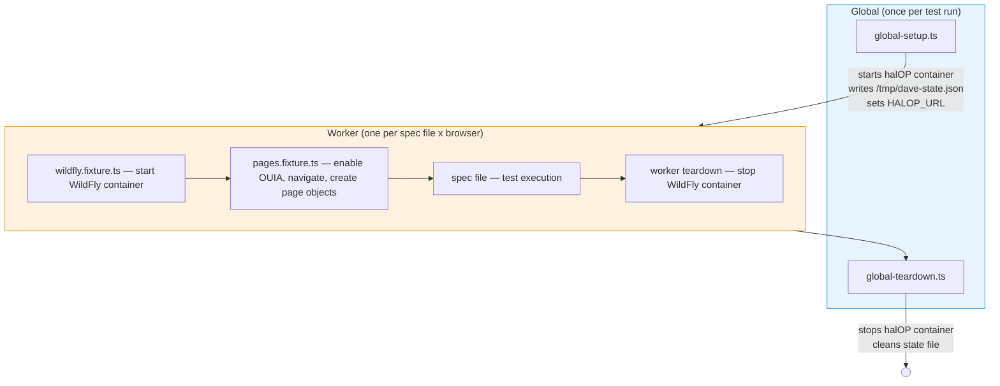
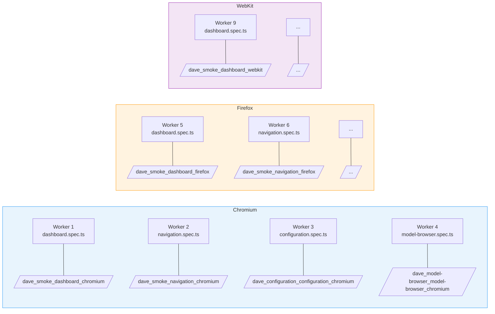

# Architecture

## Test Lifecycle



Spec files run **in parallel** across multiple workers (4 locally, 2 in CI). Tests within a spec file are sequential. Each test file gets its own isolated WildFly container per browser project via a worker-scoped Playwright fixture backed by [testcontainers](https://node.testcontainers.org/). Tests run in Chromium, Firefox, and WebKit.

For a detailed walkthrough of the four fixture layers, see [Fixtures](./fixtures.md).

## Parallelism and Container Instances

The key relationship is: **one WildFly container per spec file per browser project**.

Playwright runs three browser projects (Chromium, Firefox, WebKit). For each project, spec files are distributed across workers. The WildFly fixture is worker-scoped, and each worker runs exactly one spec file:



| Concept | Relationship |
| --- | --- |
| **Spec file** | Gets its own dedicated WildFly container — full isolation between specs |
| **Worker** | Runs one spec file; owns one WildFly container for its lifetime |
| **Browser project** | Each spec runs independently per browser, so the same spec gets a separate container in Chromium, Firefox, and WebKit |
| **Parallelism** | Up to `workers` spec files run simultaneously per browser project (4 local, 2 CI) |
| **Tests within a spec** | Run sequentially (`fullyParallel: false`), sharing that spec's WildFly container |

**Total WildFly containers** at peak = `min(workers, spec_count)` per browser project. With 10 spec files and 4 workers running Chromium, at most 4 containers run concurrently for Chromium; finished workers pick up the next spec file.

The container lifecycle: started before the first test in a worker, shared by all tests in that spec file, stopped after the last test finishes.

## WildFly Container Fixture

WildFly containers are managed by a **worker-scoped Playwright fixture** defined in [`src/fixtures/wildfly.fixture.ts`](https://github.com/hal/dave/blob/main/src/fixtures/wildfly.fixture.ts). Spec files that need WildFly and page objects import `test` from `pages.fixture.ts` and declare their spec path:

```typescript
import { test, expect } from "../../fixtures/pages.fixture.js";

test.use({ specPath: "smoke/dashboard" });
```

The fixture starts a container before any test in the worker runs and stops it after the last test finishes. Container names follow the pattern `dave_<path>_<project>` (e.g., `dave_smoke_dashboard_chromium`). Ports are dynamically allocated.

Spec files that don't need WildFly (e.g., `app-loads.spec.ts`) import `test` and `expect` from `wildfly.fixture.ts`.

## Page Object Model

Custom Playwright fixtures in [`src/fixtures/pages.fixture.ts`](https://github.com/hal/dave/blob/main/src/fixtures/pages.fixture.ts) provide page objects to each test. Page objects are pure UI concerns (locators and actions) — they don't know about WildFly URLs or infrastructure. The fixture layer handles navigation via `openHalOp(page, managementUrl)` before handing each page object to the test, so tests receive ready-to-use pages:

| Fixture             | Purpose                                                                   |
| ------------------- | ------------------------------------------------------------------------- |
| `basePage`          | Base page with shared `page` accessor                                     |
| `configurationPage` | Configuration finder tree (Subsystems, Interfaces, Socket Bindings, etc.) |
| `dashboardPage`     | Dashboard sections (overview, host, JVM, memory, log, links)              |
| `modelBrowserPage`  | Model browser tree, toolbar, tabs, and resource assertions                |
| `navigationPage`    | Sidebar navigation (Dashboard, Deployments, Configuration, Runtime, etc.) |
| `tasksPage`         | Task cards (Data source, Logging, Management SSL, etc.)                   |

Tests import `test` and `expect` from `../fixtures/pages.fixture` instead of `@playwright/test`.

## Element Identification

Tests use [OUIA](https://ouia.readthedocs.io/) attributes for element selection, following [PatternFly's](https://www.patternfly.org/developer-resources/open-ui-automation) testing conventions. The OUIA component IDs are generated locally from halOP's [`Ids.java`](https://github.com/hal/foundation/blob/main/ui/src/main/java/org/jboss/hal/ui/Ids.java) source file into [`src/selectors/ids.ts`](https://github.com/hal/dave/blob/main/src/selectors/ids.ts). Run `pnpm sync:ouia` to regenerate after upstream changes — no npm release required.

See [Sync](./sync.md) for details on keeping OUIA IDs up to date.

## Project Structure

```
dave/
  global-setup.ts              # Start halOP before tests
  global-teardown.ts           # Stop halOP after tests
  playwright.config.ts         # Playwright configuration
  scripts/
    lib/
      emit-ids.ts              # Shared TypeScript code generation for OUIA IDs
      format.ts                # ANSI color helpers for CLI output
      parse-ids.ts             # Shared Ids.java parsing logic
      preflight.ts             # Pre-flight checks for required commands
    sync-ci.ts                 # CI drift detection for OUIA IDs
    sync-ouia.ts               # Generate OUIA ID constants from GitHub
    sync-image.ts              # Pull halOP container image
    sync-status.ts             # Check sync state and report verdict
  src/
    fixtures/
      wildfly.fixture.ts       # WildFly container lifecycle (worker-scoped)
      pages.fixture.ts         # OUIA enablement, navigation, page object registry
    pages/
      base.page.ts             # Base page object
      configuration.page.ts    # Configuration page object
      dashboard.page.ts        # Dashboard page object
      model-browser.page.ts    # Model browser page object
      navigation.page.ts       # Navigation page object
      tasks.page.ts            # Tasks page object
    selectors/
      ids.ts                   # Generated OUIA ID constants (do not edit)
    tags.ts                    # Tag constants for test grouping
    tests/
      smoke/                   # Smoke tests
        app-loads.spec.ts
        dashboard.spec.ts
        navigation.spec.ts
      configuration/           # Configuration tests
        configuration.spec.ts
      model-browser/           # Model browser tests
        model-browser.spec.ts
      tasks/                   # Tasks tests
        tasks.spec.ts
    utils/
      configure-testcontainers.ts  # Testcontainers config
      container-runtime.ts         # Auto-detect Podman or Docker
      ouia.ts                      # OUIA attribute selector helper
      wildfly-container.ts         # WildFly container lifecycle
```
