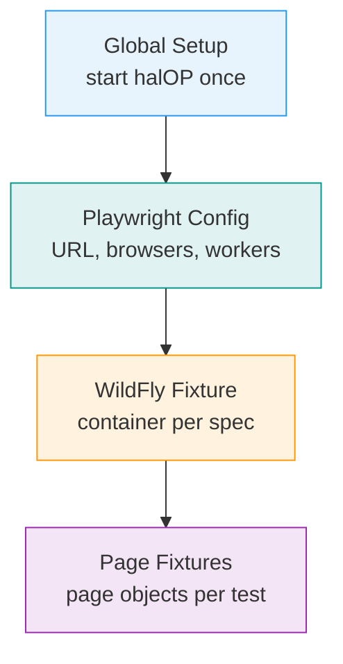
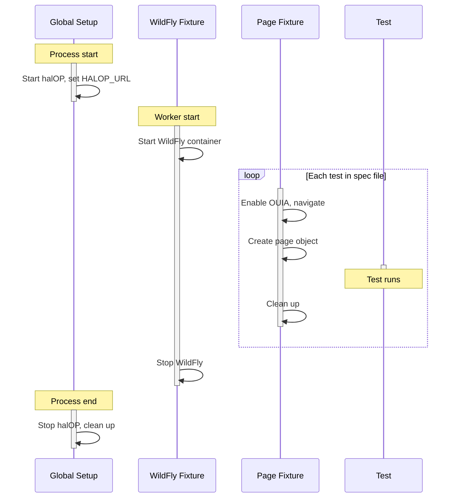
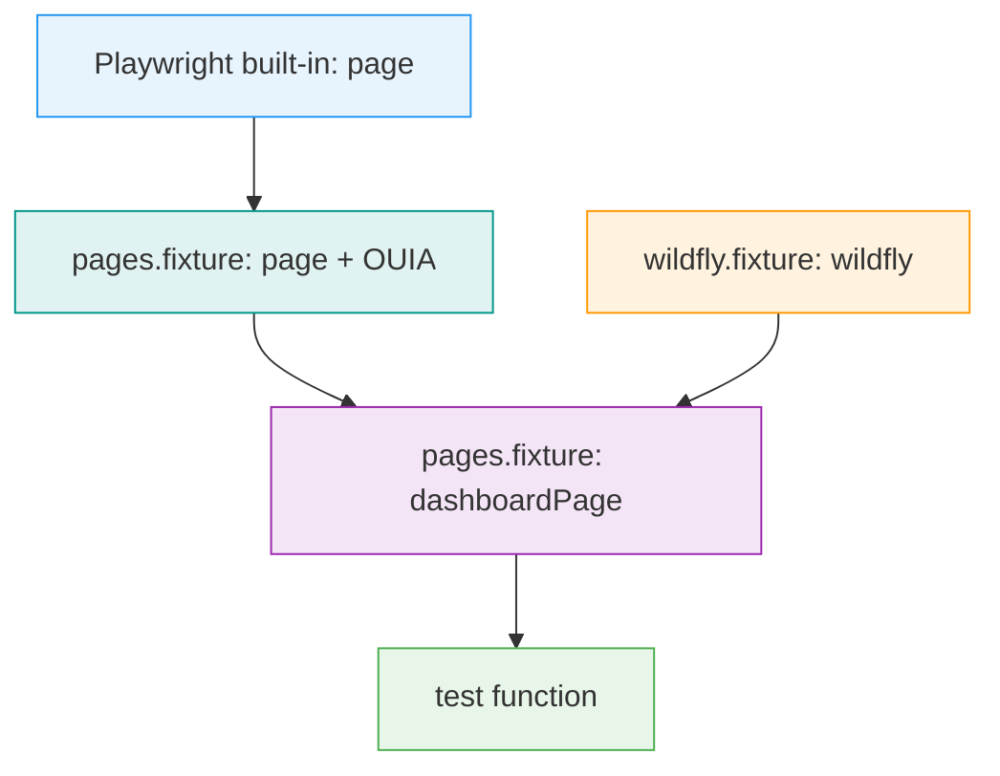

# Fixtures and Dependency Injection

This document explains how tests in this project get their dependencies — WildFly containers, browser pages, and page objects — automatically injected. If you're writing a new test, this is the guide to understand what's available and where it comes from.

## How Fixtures Work (The Short Version)

When you write a test, you list what you need in the function parameters. Playwright creates those objects for you:

```typescript
test("shows dashboard heading", async ({ dashboardPage }) => {
  // dashboardPage is already created, halOP is open, page is navigated
  await expect(dashboardPage.heading).toBeVisible();
});
```

You never call `new DashboardPage()` or start containers yourself. The **fixture system** does it.

## The Four Layers

The fixture chain has four layers, each building on the previous one:



### Layer 1: Global Setup (`global-setup.ts`)

Runs **once** before any test starts. It:

1. Removes leftover containers from previous runs (anything named `dave_*`)
2. Starts the **halOP container** (the management console SPA)
3. Writes the container ID and port to `/tmp/dave-state.json`
4. Sets `HALOP_URL` environment variable (e.g., `http://localhost:9090`)

After all tests finish, `global-teardown.ts` stops the halOP container and cleans up.

### Layer 2: Playwright Config (`playwright.config.ts`)

Configures Playwright with:

- `baseURL`: set to `HALOP_URL` — all `page.goto("/")` calls resolve against this
- Three browser projects: `chromium`, `firefox`, `webkit`
- 4 parallel workers locally, 2 in CI
- References to global setup/teardown

### Layer 3: WildFly Fixture (`src/fixtures/wildfly.fixture.ts`)

Extends Playwright's base `test` with a **worker-scoped** WildFly container:

```typescript
interface WildFlyWorkerFixtures {
  specPath: string; // set by test files via test.use()
  wildfly: WildFlyContainer; // the running container
}
```

**How it works:**

1. Each spec file sets `specPath` via `test.use({ specPath: "smoke/dashboard" })`
2. The fixture derives a container name: `dave_smoke_dashboard_chromium`
3. It starts a WildFly container (image, ports, healthcheck wait)
4. The `wildfly` object is available to all tests in that worker
5. After all tests in the worker finish, the container is stopped

Because the scope is `worker`, the container is shared across all tests in the same spec file — it's not restarted between individual tests.

**The `WildFlyContainer` object provides:**

```typescript
interface WildFlyContainer {
  container: StartedTestContainer; // the testcontainers handle
  httpUrl: string; // http://localhost:<mapped-8080> — for deployments
  managementUrl: string; // http://localhost:<mapped-9990> — for management API
}
```

### Layer 4: Page Fixtures (`src/fixtures/pages.fixture.ts`)

Extends the WildFly fixture with **test-scoped** page objects. The full list of available page fixtures is defined in [`src/fixtures/pages.fixture.ts`](https://github.com/hal/dave/blob/main/src/fixtures/pages.fixture.ts) — check that file for the current set.

**What each fixture does before handing you the page object:**

1. Enables OUIA attributes (sets `localStorage.ouia = "true"` via `page.addInitScript`)
2. Navigates to halOP with the WildFly connection parameter: `/?connect=<managementUrl>`
3. Waits for the main content area to be visible
4. Creates the page object
5. Some page objects call `navigate()` to reach their specific section (e.g., Configuration, Model Browser)

Because the scope is `test`, you get a **fresh page object** for every test — even if the tests share a WildFly container.

## What's Available in Tests

### Importing from `pages.fixture.ts` (most tests)

When you import `test` from `pages.fixture.ts`, you get everything:

```typescript
import { test, expect } from "../../fixtures/pages.fixture.js";

test.use({ specPath: "smoke/dashboard" });

test("example", async ({ page, wildfly, dashboardPage }) => {
  // page          — Playwright's Page (with OUIA enabled)
  // wildfly       — the WildFly container (httpUrl, managementUrl)
  // dashboardPage — the DashboardPage object (halOP already open)
});
```

The infrastructure fixtures are always available:

| Fixture   | Type               | Scope  | Description                                              |
| --------- | ------------------ | ------ | -------------------------------------------------------- |
| `page`    | Playwright `Page`  | test   | The browser tab (OUIA already enabled)                   |
| `wildfly` | `WildFlyContainer` | worker | The WildFly container — `httpUrl` and `managementUrl`    |

Page object fixtures (like `dashboardPage`, `configurationPage`, etc.) are test-scoped and registered in [`src/fixtures/pages.fixture.ts`](https://github.com/hal/dave/blob/main/src/fixtures/pages.fixture.ts). Check that file for the current list. Each one opens halOP, optionally navigates to a section, and hands you a ready-to-use page object.

In addition, Playwright's [built-in fixtures](https://playwright.dev/docs/api/class-fixtures) are always available: `context` (the `BrowserContext`), `browser` (the `Browser` instance), `browserName` (`"chromium"`, `"firefox"`, or `"webkit"`), and `request` (an `APIRequestContext` for direct HTTP calls). These are rarely needed since `page` covers most cases.

### Importing from `wildfly.fixture.ts` (simple tests)

For tests that don't need page objects (e.g., just checking halOP loads):

```typescript
import { test, expect } from "../../fixtures/wildfly.fixture.js";

test("halOP serves the SPA", async ({ page }) => {
  await page.goto("/");
  await expect(page).toHaveTitle(/hal/i);
});
```

This gives you `page` and the Playwright built-ins, but no page objects and no WildFly container (unless you explicitly destructure `wildfly`).

## The Full Lifecycle

Here's what happens when you run a test like this:

```typescript
import { test, expect } from "../../fixtures/pages.fixture.js";
test.use({ specPath: "smoke/dashboard" });

test("shows dashboard heading", async ({ dashboardPage }) => {
  await expect(dashboardPage.heading).toBeVisible();
});
```



## Lazy Evaluation

Fixtures are **lazy** — they're only created if the test actually requests them. If your test only uses `{ dashboardPage }`, the `configurationPage` fixture never runs. This means:

- No unnecessary navigation
- No wasted setup time
- You only pay for what you use

## The `use()` Pattern

Every fixture follows the same pattern:

```typescript
myFixture: async ({ dependencies }, use) => {
  // SETUP — runs before the test
  const thing = await createThing();

  await use(thing); // ← hand the object to the test; test runs here

  // TEARDOWN — runs after the test
  await cleanupThing(thing);
};
```

The `use()` call is the boundary: setup above, teardown below. Playwright guarantees teardown runs even if the test fails.

## Fixture Dependency Chain

Fixtures can depend on other fixtures. The chain in this project:



Playwright resolves the dependency graph automatically. When you request `dashboardPage`, Playwright knows it needs `page` and `wildfly` first, creates them in order, and tears them down in reverse order.
