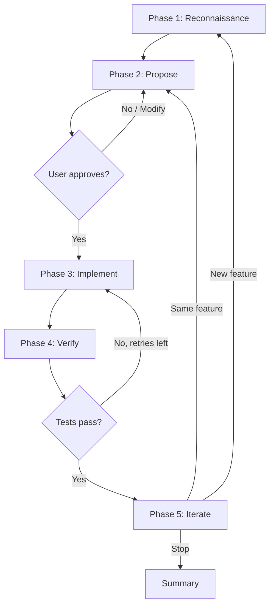
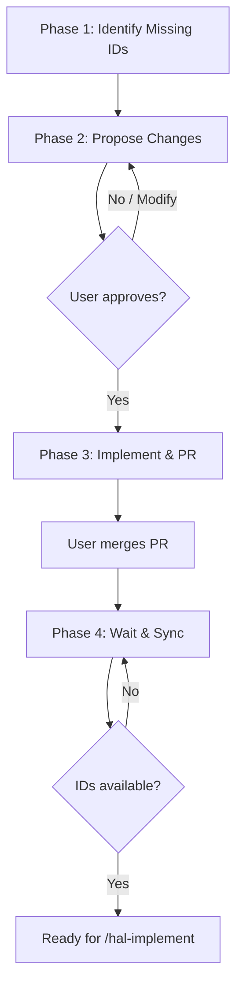
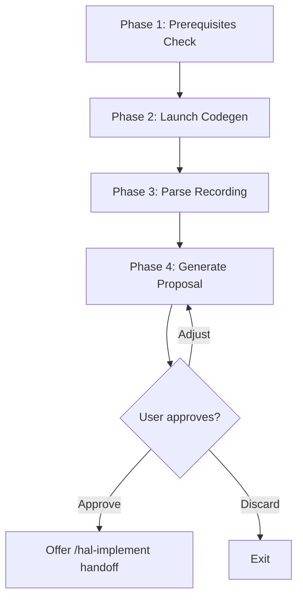

# Skills

dave includes a [Claude Code plugin](https://docs.anthropic.com/en/docs/claude-code/plugins) that bundles skills for developing and testing halOP. Skills are invoked as slash commands in Claude Code (e.g., `/hal-dev-env`) or triggered by natural language (e.g., "start the dev environment").

## Plugin Structure

```text
.claude-plugin/
├── plugin.json                  # Plugin manifest
└── skills/
    ├── hal-dev-env/
    │   └── SKILL.md             # Dev environment management
    ├── hal-explore/
    │   ├── SKILL.md             # Coverage gap analysis
    │   └── references/
    │       └── proposal-format.md   # Test scenario proposal template
    ├── hal-implement/
    │   ├── SKILL.md             # Interactive test implementation
    │   └── references/
    │       └── conventions.md       # Dave conventions (page objects, fixtures, specs, DMR, tags)
    ├── hal-ouia/
    │   ├── SKILL.md             # OUIA ID management & upstream sync
    │   └── references/
    │       └── conventions.md       # OUIA ID naming rules and OuiaIds.java organization
    └── hal-record/
        └── SKILL.md             # Record browser interactions & scaffold test proposals
```

## hal-dev-env

**Trigger:** `/hal-dev-env`, "start dev environment", "start halop", "start wildfly for dev", "stop dev environment", "dev env status"

Manages a containerized local development environment for halOP. Starts WildFly and halOP containers on dedicated ports (19990 and 19090) that don't conflict with the test suite's default ports.

### Subcommands

| Subcommand        | Description                                      |
| ----------------- | ------------------------------------------------ |
| `start` (default) | Start WildFly and halOP containers, open browser |
| `stop`            | Stop and remove both containers                  |
| `status`          | Check running state and report URLs              |

### Ports

| Service            | Port  | URL                                                      |
| ------------------ | ----- | -------------------------------------------------------- |
| halOP              | 19090 | `http://localhost:19090`                                 |
| WildFly Management | 19990 | `http://localhost:19990/management`                      |
| Console            | —     | `http://localhost:19090/?connect=http://localhost:19990` |

The skill auto-detects whether Docker or Podman is available, using the same detection logic as the test suite (`src/utils/container-runtime.ts`). All operations are idempotent — running `start` when containers are already running reports the current state without re-creating them.

### Configuration

The skill stores the path to the `hal/foundation` repository in `.claude/hal-config.json`. On first run, it checks `../foundation` relative to dave's root; if not found, it prompts for the path.

## hal-explore

**Trigger:** `/hal-explore`, "explore halop", "find untested features", "coverage gaps", "what should we test next"

Identifies untested halOP features by cross-referencing the halOP source tree with existing dave tests and page objects, then optionally explores the live UI to propose concrete test scenarios.

### Arguments

| Argument         | Description                                                          |
| ---------------- | -------------------------------------------------------------------- |
| (none) or `gaps` | Phase 1 only: code-level gap analysis                                |
| `explore`        | Phase 1 + Phase 2: gap analysis followed by browser exploration      |
| `explore-only`   | Phase 2 only: browser exploration (requires dev environment running) |

### Phase 1: Code-Level Gap Analysis

Scans the halOP feature directories (`op/console/src/main/java/org/jboss/hal/op/`) and compares them against dave's test files, page objects, and OUIA ID coverage. Produces a prioritized gap report:

- **Full Gap** — no tests and no page objects
- **Needs Tests** — page objects exist but no spec files
- **Needs Page** — tests reference features without dedicated page objects
- **Covered** — both tests and page objects exist

### Phase 2: Browser Exploration

Navigates the running halOP console via Chrome DevTools MCP, captures accessibility snapshots, and identifies available OUIA IDs and interactive elements. Cross-references discovered UI elements with `src/selectors/ids.ts` to determine which elements can already be targeted in tests.

### Output

Proposes concrete test scenarios for each gap, including page object structure, spec file layout, DMR setup/teardown, and test cases. Proposals follow dave conventions exactly — they can be handed directly to `/hal-implement`.

## hal-implement

**Trigger:** `/hal-implement`, "implement test", "write test for", "add test coverage for", "test this feature"

Writes new test cases and page objects following an interactive propose-approve-implement loop. The skill reads halOP source code, explores the live UI, proposes a test case for user approval, then writes page objects, fixtures, and spec files following dave conventions.

### Arguments

| Argument          | Description                                                  |
| ----------------- | ------------------------------------------------------------ |
| (none)            | Start with reconnaissance — pick a feature to test           |
| Feature name      | Target a specific feature (e.g., `configuration`, `runtime`) |
| halOP source path | Target a specific Java class                                 |
| hal-explore gap   | Implement a specific gap from a `/hal-explore` report        |

### Workflow



**Phase 1 — Reconnaissance:** Reads halOP Java source to understand the feature. If the dev environment is running, explores the live UI to discover available elements and OUIA IDs.

**Phase 2 — Propose:** Presents a test case proposal including page object structure, fixture registration, spec file content, DMR setup/teardown, and individual test cases. Waits for user approval before writing any code.

**Phase 3 — Implement:** Creates or updates page objects, registers fixtures, adds tags, writes spec files. Runs `pnpm format` and `pnpm lint:fix` after writing code.

**Phase 4 — Verify:** Runs the new test in Chromium. If tests fail, analyzes the error and retries (up to 3 attempts). Commits passing tests.

**Phase 5 — Iterate:** Asks whether to write more tests for the same feature, switch to a new feature, or stop.

### Conventions

The skill follows dave's established patterns exactly:

- Page objects extend `BasePage` with `readonly` locators
- OUIA selectors are preferred over CSS selectors
- Fixtures are registered in `src/fixtures/pages.fixture.ts`
- Tags follow the `UPPER_SNAKE_CASE` key / `@kebab-case` value convention
- DMR utilities (`addResource`, `removeResource`) handle server state setup and teardown

## hal-ouia

**Trigger:** `/hal-ouia`, "add ouia id", "add ouia ids", "missing ouia", "fix selectors", "make testable"

Adds missing OUIA IDs to halOP Java source, creates PRs on `hal/foundation`, monitors CI, and syncs the generated constants back to dave. Closes the loop between discovering missing IDs (via `/hal-explore` or `/hal-implement`) and making elements testable.

### Arguments

| Argument       | Description                                                              |
| -------------- | ------------------------------------------------------------------------ |
| (none)         | Interactive mode: browse the live UI to find elements missing OUIA IDs   |
| Spec file path | Audit an existing test's selectors for OUIA ID replacement opportunities |
| Element list   | Targeted mode: add specific missing IDs from a gap report                |
| `sync`         | Skip to Phase 4: wait for CI and sync dave                               |
| `status`       | Check CI pipeline and container image status                             |

### Workflow



**Phase 1 — Identify Missing IDs:** Accepts input from three modes: audit an existing spec file's selectors, interactively browse the live UI, or parse a gap report from `/hal-explore` or `/hal-implement`.

**Phase 2 — Propose Changes:** Presents the list of `OuiaIds.java` constants to add and Java files to modify. Waits for user approval before writing any code.

**Phase 3 — Implement & PR:** Adds constants to `OuiaIds.java`, chains `.ouiaId(OuiaIds.CONSTANT)` calls in Java source, verifies compilation (`./mvnw compile -P op`), commits, and creates a PR on `hal/foundation`.

**Phase 4 — Wait & Sync:** After the user merges the PR, monitors CI pipelines, waits for the new container image, then runs `pnpm sync:ouia` and `pnpm sync:image` to bring the new IDs into dave.

### Spec File Audit

When given a spec file path, the skill traces imports to find page objects and classifies every selector:

- **Already OUIA** — uses `ouiaSelector()`, no action needed
- **Can replace with OUIA** — uses `getByRole()`, `getByText()`, or CSS selectors for elements with stable identity
- **Not suitable** — dynamic text or elements where semantic locators are correct

For each replacement candidate, the skill locates the corresponding Java file where `.ouiaId()` should be added.

## hal-record

**Trigger:** `/hal-record`, "record test", "record interaction", "capture test", "codegen"

Records user interactions in a live halOP browser session via Playwright codegen and produces a test proposal that feeds into `/hal-implement`. Bridges the gap between manual exploration and test scaffolding by capturing real user actions and transforming them into dave-convention proposals.

### Arguments

| Argument     | Description                                                        |
| ------------ | ------------------------------------------------------------------ |
| (none)       | Launch codegen immediately, infer feature area from the recording  |
| Feature name | Pre-tag the proposal with the feature area, skipping inference     |

### Workflow



**Phase 1 — Prerequisites:** Verifies halOP (port 19090), WildFly (port 19990), and Playwright are available. Does not start containers — that is `/hal-dev-env`'s job.

**Phase 2 — Launch Codegen:** Runs `npx playwright codegen` with OUIA-aware configuration (`--test-id-attribute data-ouia-component-id`). The user interacts with halOP in the codegen browser and closes it when done.

**Phase 3 — Parse Recording:** Reads the recording, classifies actions (navigation, click, fill, assertion), maps `getByTestId` selectors to OUIA constants from `src/selectors/ids.ts`, and infers the feature area from navigation paths.

**Phase 4 — Generate Proposal:** Produces a test proposal in the exact `/hal-implement` format, including page object structure, fixture registration, test cases, and OUIA coverage summary.

**Phase 5 — Approval & Handoff:** Presents the proposal for approval. On approval, offers to invoke `/hal-implement` to write the code.

## Skill Workflow

The five skills form a pipeline for test development:

```text
hal-dev-env (start) → hal-explore (find gaps) → hal-ouia (add missing IDs) → hal-record (capture) → hal-implement (write tests)
                                                       ↓
                                                  PR + CI + sync
```

## Prerequisites

All skills require:

- **Podman** or **Docker** — for running containers
- **hal/foundation repository** — path configured in `.claude/hal-config.json` or at `../foundation`

Browser exploration (hal-explore Phase 2, hal-implement Phase 1, hal-ouia interactive mode) and recording (hal-record) additionally requires:

- **Chrome DevTools MCP** — for browser interaction
- **Running dev environment** — start with `/hal-dev-env start`

OUIA ID management (hal-ouia) additionally requires:

- **GitHub CLI (`gh`)** — for creating PRs and monitoring CI workflows
