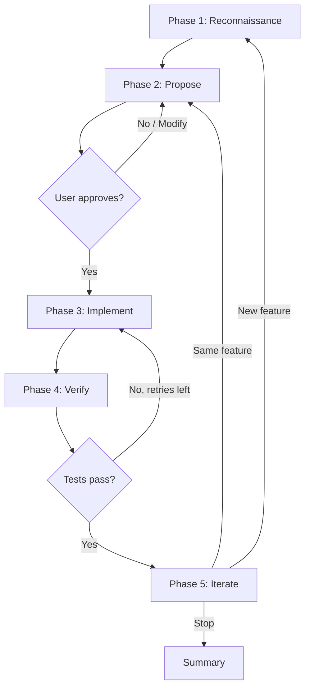

# Skills

dave includes a [Claude Code plugin](https://docs.anthropic.com/en/docs/claude-code/plugins) that bundles skills for developing and testing halOP. Skills are invoked as slash commands in Claude Code (e.g., `/hal-dev-env`) or triggered by natural language (e.g., "start the dev environment").

## Plugin Structure

```
.claude-plugin/
├── plugin.json                  # Plugin manifest
└── skills/
    ├── hal-dev-env/SKILL.md     # Dev environment management
    ├── hal-explore/SKILL.md     # Coverage gap analysis
    └── hal-implement/SKILL.md   # Interactive test implementation
```

## hal-dev-env

**Trigger:** `/hal-dev-env`, "start dev environment", "start halop", "start wildfly for dev", "stop dev environment", "dev env status"

Manages a containerized local development environment for halOP. Starts WildFly and halOP containers on dedicated ports (19990 and 19090) that don't conflict with the test suite's default ports.

### Subcommands

| Subcommand        | Description                                      |
| ----------------- | ------------------------------------------------ |
| `start` (default) | Start WildFly and halOP containers, open browser |
| `stop`            | Stop and remove both containers                  |
| `status`          | Check running state and report URLs              |

### Ports

| Service            | Port  | URL                                                      |
| ------------------ | ----- | -------------------------------------------------------- |
| halOP              | 19090 | `http://localhost:19090`                                 |
| WildFly Management | 19990 | `http://localhost:19990/management`                      |
| Console            | —     | `http://localhost:19090/?connect=http://localhost:19990` |

The skill auto-detects whether Docker or Podman is available, using the same detection logic as the test suite (`src/utils/container-runtime.ts`). All operations are idempotent — running `start` when containers are already running reports the current state without re-creating them.

### Configuration

The skill stores the path to the `hal/foundation` repository in `.claude/hal-config.json`. On first run, it checks `../foundation` relative to dave's root; if not found, it prompts for the path.

## hal-explore

**Trigger:** `/hal-explore`, "explore halop", "find untested features", "coverage gaps", "what should we test next"

Identifies untested halOP features by cross-referencing the halOP source tree with existing dave tests and page objects, then optionally explores the live UI to propose concrete test scenarios.

### Arguments

| Argument         | Description                                                          |
| ---------------- | -------------------------------------------------------------------- |
| (none) or `gaps` | Phase 1 only: code-level gap analysis                                |
| `explore`        | Phase 1 + Phase 2: gap analysis followed by browser exploration      |
| `explore-only`   | Phase 2 only: browser exploration (requires dev environment running) |

### Phase 1: Code-Level Gap Analysis

Scans the halOP feature directories (`op/console/src/main/java/org/jboss/hal/op/`) and compares them against dave's test files, page objects, and OUIA ID coverage. Produces a prioritized gap report:

- **Full Gap** — no tests and no page objects
- **Needs Tests** — page objects exist but no spec files
- **Needs Page** — tests reference features without dedicated page objects
- **Covered** — both tests and page objects exist

### Phase 2: Browser Exploration

Navigates the running halOP console via Chrome DevTools MCP, captures accessibility snapshots, and identifies available OUIA IDs and interactive elements. Cross-references discovered UI elements with `src/selectors/ids.ts` to determine which elements can already be targeted in tests.

### Output

Proposes concrete test scenarios for each gap, including page object structure, spec file layout, DMR setup/teardown, and test cases. Proposals follow dave conventions exactly — they can be handed directly to `/hal-implement`.

## hal-implement

**Trigger:** `/hal-implement`, "implement test", "write test for", "add test coverage for", "test this feature"

Writes new test cases and page objects following an interactive propose-approve-implement loop. The skill reads halOP source code, explores the live UI, proposes a test case for user approval, then writes page objects, fixtures, and spec files following dave conventions.

### Arguments

| Argument          | Description                                                  |
| ----------------- | ------------------------------------------------------------ |
| (none)            | Start with reconnaissance — pick a feature to test           |
| Feature name      | Target a specific feature (e.g., `configuration`, `runtime`) |
| halOP source path | Target a specific Java class                                 |
| hal-explore gap   | Implement a specific gap from a `/hal-explore` report        |

### Workflow



**Phase 1 — Reconnaissance:** Reads halOP Java source to understand the feature. If the dev environment is running, explores the live UI to discover available elements and OUIA IDs.

**Phase 2 — Propose:** Presents a test case proposal including page object structure, fixture registration, spec file content, DMR setup/teardown, and individual test cases. Waits for user approval before writing any code.

**Phase 3 — Implement:** Creates or updates page objects, registers fixtures, adds tags, writes spec files. Runs `pnpm format` and `pnpm lint:fix` after writing code.

**Phase 4 — Verify:** Runs the new test in Chromium. If tests fail, analyzes the error and retries (up to 3 attempts). Commits passing tests.

**Phase 5 — Iterate:** Asks whether to write more tests for the same feature, switch to a new feature, or stop.

### Conventions

The skill follows dave's established patterns exactly:

- Page objects extend `BasePage` with `readonly` locators
- OUIA selectors are preferred over CSS selectors
- Fixtures are registered in `src/fixtures/pages.fixture.ts`
- Tags follow the `UPPER_SNAKE_CASE` key / `@kebab-case` value convention
- DMR utilities (`addResource`, `removeResource`) handle server state setup and teardown

## Prerequisites

All skills require:

- **Podman** or **Docker** — for running containers
- **hal/foundation repository** — path configured in `.claude/hal-config.json` or at `../foundation`

Browser exploration (hal-explore Phase 2, hal-implement Phase 1) additionally requires:

- **Chrome DevTools MCP** — for browser interaction
- **Running dev environment** — start with `/hal-dev-env start`
