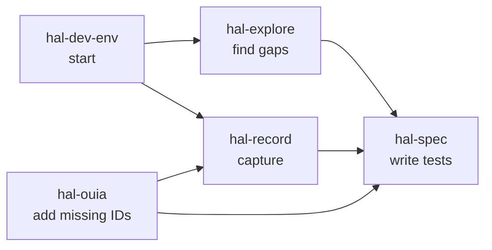
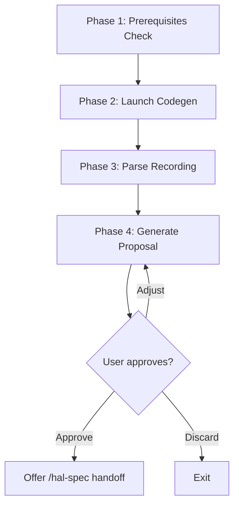
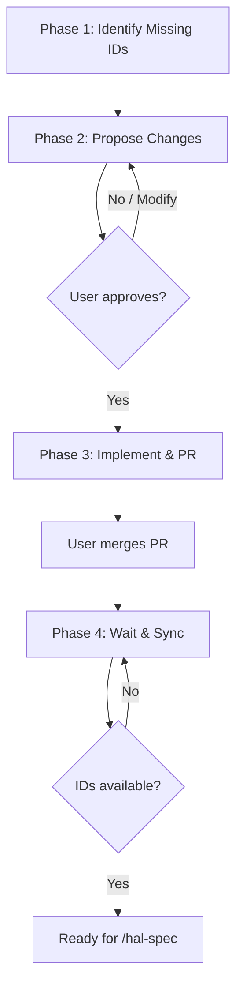
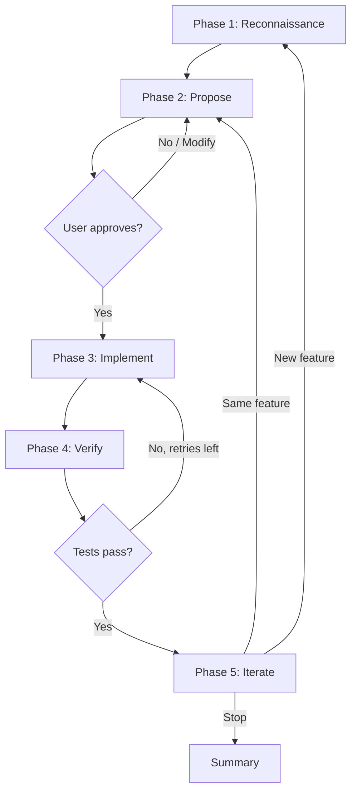

# Skills

dave includes project-level [skills](https://docs.anthropic.com/en/docs/claude-code/skills) and [agents](https://docs.anthropic.com/en/docs/claude-code/agents) in `.claude/` for developing and testing halOP. Skills are invoked as slash commands in Claude Code (e.g., `/hal-dev-env`) or triggered by natural language (e.g., "start the dev environment").

## Skill Pipeline

The five skills form a pipeline with two parallel discovery paths that converge on implementation:

### Quick Reference

| I want to...                                   | Skill         |
| ---------------------------------------------- | ------------- |
| Start a running halOP + WildFly to work with   | hal-dev-env   |
| Find out what should be tested next            | hal-explore   |
| Record a browser interaction as a test         | hal-record    |
| Add missing OUIA IDs to make elements testable | hal-ouia      |
| Write test code (page objects, specs)          | hal-spec      |

### Entry Paths

**Analytical path** — use when you don't know what to test next:

1. `/hal-dev-env start` — start the containers
2. `/hal-explore` — scan for coverage gaps, produce test proposals
3. `/hal-ouia` — add missing OUIA IDs if the proposal flags them (optional)
4. `/hal-spec` — write the tests from the approved proposal

**Recording path** — use when you know the interaction to test:

1. `/hal-dev-env start` — start the containers
2. `/hal-record` — record the interaction, produce a test proposal
3. `/hal-spec` — write the tests from the approved proposal

**Direct path** — use when you already know exactly what to implement:

1. `/hal-dev-env start` — start the containers
2. `/hal-spec <feature>` — runs its own single-feature reconnaissance, then proposes and implements

### Proposal Handoff

`/hal-explore` and `/hal-record` both produce proposals in the same format (defined in `hal-explore/references/proposal-format.md`). When `/hal-spec` receives a proposal from either skill, it skips its own reconnaissance phase and goes directly to implementation.

### I/O Summary

| Skill         | Input                                              | Output                              | Feeds Into                                 |
| ------------- | -------------------------------------------------- | ----------------------------------- | ------------------------------------------ |
| hal-dev-env   | Subcommand (start/stop/status)                     | Running containers on 19090/19990   | All other skills                           |
| hal-explore   | Argument (gaps/explore/explore-only)               | Gap report + test proposals         | hal-spec, hal-ouia                         |
| hal-record    | Optional feature name                              | Test proposal                       | hal-spec                                   |
| hal-ouia      | Spec file, element list, interactive, sync, status | PR on foundation + synced ids.ts    | hal-spec                                   |
| hal-spec      | Feature name, gap, proposal, or source path        | Page objects, specs, fixtures, tags | Terminal (OUIA gaps feed back to hal-ouia) |

---

## hal-dev-env

> Manages a containerized local WildFly + halOP development environment.

### Fact Sheet

| Attribute       | Value                                                                          |
| --------------- | ------------------------------------------------------------------------------ |
| Invocation      | `/hal-dev-env`, "start dev environment", "start halop", "stop dev environment" |
| Automation      | **Fully automatic** — runs without user interaction                            |
| Input           | Subcommand: `start` (default), `stop`, or `status`                             |
| Output          | Running WildFly + halOP containers on ports 19990 and 19090                    |
| Depends on      | Nothing — this is the first skill to run                                       |
| Feeds into      | All other skills (they require the dev environment)                            |
| Dev environment | N/A — this skill *creates* the dev environment                                 |
| Browser (MCP)   | Not needed                                                                     |
| Other prereqs   | Podman or Docker; hal/foundation repository path                               |

### When to Use

Use this skill before any other skill that needs a running halOP console. It starts WildFly (management on port 19990) and halOP (UI on port 19090) in containers and opens the console in a browser. All operations are idempotent — running `start` when containers are already running reports the current state.

### How It Works

The skill auto-detects whether Docker or Podman is available (same logic as `src/utils/container-runtime.ts`). It starts WildFly with `standalone-no-auth.xml` (no management authentication), waits for the management interface health check, then starts halOP and waits for it to become available.

### Subcommands

| Subcommand        | Description                                      |
| ----------------- | ------------------------------------------------ |
| `start` (default) | Start WildFly and halOP containers, open browser |
| `stop`            | Stop and remove both containers                  |
| `status`          | Check running state and report URLs              |

### Ports

| Service            | Port  | URL                                                      |
| ------------------ | ----- | -------------------------------------------------------- |
| halOP              | 19090 | `http://localhost:19090`                                 |
| WildFly Management | 19990 | `http://localhost:19990/management`                      |
| Console            | —     | `http://localhost:19090/?connect=http://localhost:19990` |

### Configuration

The skill stores the path to the `hal/foundation` repository in `.claude/hal-config.json`. On first run, it checks `../foundation` relative to dave's root; if not found, it prompts for the path.

---

## hal-explore

> Identifies untested halOP features and proposes test scenarios.

### Fact Sheet

| Attribute       | Value                                                                                 |
| --------------- | ------------------------------------------------------------------------------------- |
| Invocation      | `/hal-explore`, "explore halop", "find untested features", "what should we test next" |
| Automation      | **Mixed** — automatic analysis, user reviews and selects proposals                    |
| Input           | Argument selecting scope: `gaps` (default), `explore`, or `explore-only`              |
| Output          | Prioritized gap report + test proposals in `/hal-spec` format                         |
| Depends on      | hal-dev-env (Phase 2 browser exploration only)                                        |
| Feeds into      | hal-spec (proposals), hal-ouia (missing OUIA IDs)                                     |
| Dev environment | Required for Phase 2 (browser exploration); not needed for Phase 1 (code analysis)    |
| Browser (MCP)   | Required for Phase 2; not needed for Phase 1                                          |
| Other prereqs   | hal/foundation repository path                                                        |

### When to Use

Use this skill when you don't know what to test next. It scans the halOP source tree and cross-references it with existing dave tests and page objects to find coverage gaps. Optionally, it explores the live UI to discover available OUIA IDs and interactive elements, then proposes concrete test scenarios ready for `/hal-spec`.

### How It Works

**Phase 1 — Code-Level Gap Analysis:** Scans halOP feature directories and compares them against dave's test files, page objects, and OUIA ID coverage. Classifies each feature as:

- **Full Gap** — no tests and no page objects
- **Needs Tests** — page objects exist but no spec files
- **Needs Page** — tests reference features without dedicated page objects
- **Covered** — both tests and page objects exist

**Phase 2 — Browser Exploration:** Navigates the running halOP console via Chrome DevTools MCP, captures accessibility snapshots, and identifies available OUIA IDs and interactive elements. Cross-references discovered UI elements with `src/selectors/ids.ts`.

After analysis, proposes concrete test scenarios including page object structure, fixture registration, spec file layout, DMR setup/teardown, OUIA coverage, and test cases. Proposals follow the shared format in `references/proposal-format.md`.

### Arguments

| Argument         | Description                                                          |
| ---------------- | -------------------------------------------------------------------- |
| (none) or `gaps` | Phase 1 only: code-level gap analysis                                |
| `explore`        | Phase 1 + Phase 2: gap analysis followed by browser exploration      |
| `explore-only`   | Phase 2 only: browser exploration (requires dev environment running) |

---

## hal-record

> Records browser interactions via Playwright codegen and scaffolds test proposals.

### Fact Sheet

| Attribute       | Value                                                                                |
| --------------- | ------------------------------------------------------------------------------------ |
| Invocation      | `/hal-record`, "record test", "record interaction", "capture test", "codegen"        |
| Automation      | **Mixed** — user records manually in browser, skill automatically generates proposal |
| Input           | Optional feature name to pre-tag the proposal                                        |
| Output          | Test proposal in `/hal-spec` format (same as `/hal-explore` proposals)               |
| Depends on      | hal-dev-env (requires running containers for the codegen browser session)            |
| Feeds into      | hal-spec (approved proposal skips hal-spec's reconnaissance)                         |
| Dev environment | Required                                                                             |
| Browser (MCP)   | Not needed (uses Playwright codegen directly, not Chrome DevTools MCP)               |
| Other prereqs   | Playwright installed (`pnpm install`)                                                |

### When to Use

Use this skill when you know the interaction you want to test and want to capture it by doing it. The skill launches Playwright's codegen recorder against the running halOP console — you interact with the UI, close the browser when done, and the skill transforms your recorded actions into a dave-convention test proposal.

### How It Works

**Phase 1 — Prerequisites:** Verifies halOP (port 19090), WildFly (port 19990), and Playwright are available. Does not start containers — that is `/hal-dev-env`'s job.

**Phase 2 — Launch Codegen:** Runs `pnpm exec playwright codegen` with OUIA-aware configuration (`--test-id-attribute data-ouia-component-id`). The user interacts with halOP in the codegen browser and closes it when done.

**Phase 3 — Parse Recording:** Reads the recording, classifies actions (navigation, click, fill, assertion), maps `getByTestId` selectors to OUIA constants from `src/selectors/ids.ts`, and infers the feature area from navigation paths.

**Phase 4 — Generate Proposal:** Produces a test proposal in the shared `/hal-spec` format, including page object structure, fixture registration, test cases, and OUIA coverage summary.

**Phase 5 — Approval & Handoff:** Presents the proposal for approval. On approval, offers to invoke `/hal-spec` to write the code.

### Arguments

| Argument     | Description                                                       |
| ------------ | ----------------------------------------------------------------- |
| (none)       | Launch codegen immediately, infer feature area from the recording |
| Feature name | Pre-tag the proposal with the feature area, skipping inference    |

---

## hal-ouia

> Adds missing OUIA IDs to halOP, creates PRs on hal/foundation, and syncs constants back to dave.

### Fact Sheet

| Attribute       | Value                                                                                             |
| --------------- | ------------------------------------------------------------------------------------------------- |
| Invocation      | `/hal-ouia`, "add ouia id", "missing ouia", "fix selectors", "make testable"                      |
| Automation      | **Mixed** — proposes changes for user approval, automates PR creation and sync                    |
| Input           | One of: interactive (no args), spec file path, element list from gap report, `sync`, `status`     |
| Output          | PR on `hal/foundation` adding OUIA IDs + synced `src/selectors/ids.ts` constants in dave          |
| Depends on      | hal-dev-env (interactive mode only); fed by hal-explore or hal-spec (OUIA Coverage sections)      |
| Feeds into      | hal-spec (new OUIA constants become available for test selectors after sync)                      |
| Dev environment | Required for interactive mode; not needed for spec-file audit or element-list modes               |
| Browser (MCP)   | Required for interactive mode; not needed for other modes                                         |
| Other prereqs   | hal/foundation repository path; GitHub CLI (`gh`) for PR creation and CI monitoring               |

### When to Use

Use this skill when tests need to target UI elements that don't have OUIA IDs yet. This typically happens when `/hal-explore` or `/hal-spec` flags missing IDs in their OUIA Coverage section. The skill adds constants to `OuiaIds.java`, chains `.ouiaId()` calls in the Java source, creates a PR, and after merge syncs the new IDs back to dave.

### How It Works

**Phase 1 — Identify Missing IDs:** Three input modes: (a) audit an existing spec file's selectors for OUIA replacement opportunities, (b) interactively browse the live UI to find elements without OUIA IDs, or (c) parse a gap report from `/hal-explore` or `/hal-spec`.

**Phase 2 — Propose Changes:** Presents the list of `OuiaIds.java` constants to add and Java files to modify. Waits for user approval.

**Phase 3 — Implement & PR:** Adds constants, chains `.ouiaId()` calls, verifies compilation (`./mvnw compile -P op`), commits, and creates a PR on `hal/foundation`.

**Phase 4 — Wait & Sync:** After the user merges the PR, monitors CI, waits for the new container image, then runs `pnpm sync:ouia` and `pnpm sync:image` to bring the new IDs into dave.

### Arguments

| Argument       | Description                                                              |
| -------------- | ------------------------------------------------------------------------ |
| (none)         | Interactive mode: browse the live UI to find elements missing OUIA IDs   |
| Spec file path | Audit an existing test's selectors for OUIA ID replacement opportunities |
| Element list   | Targeted mode: add specific missing IDs from a gap report                |
| `sync`         | Skip to Phase 4: wait for CI and sync dave                               |
| `status`       | Check CI pipeline and container image status                             |

### Spec File Audit

When given a spec file path, the skill traces imports to find page objects and classifies every selector:

- **Already OUIA** — uses `ouiaSelector()`, no action needed
- **Can replace with OUIA** — uses `getByRole()`, `getByText()`, or CSS selectors for elements with stable identity
- **Not suitable** — dynamic text or elements where semantic locators are correct

For each replacement candidate, the skill locates the corresponding Java file where `.ouiaId()` should be added.

---

## hal-spec

> Writes new test cases and page objects interactively via a propose-approve-implement loop.

### Fact Sheet

| Attribute       | Value                                                                                                 |
| --------------- | ----------------------------------------------------------------------------------------------------- |
| Invocation      | `/hal-spec`, "implement test", "write test for", "add test coverage for", "test this feature"         |
| Automation      | **Mixed** — proposes test cases for user approval, then implements and verifies automatically         |
| Input           | One of: feature name, halOP source path, `/hal-explore` gap, `/hal-record` proposal, or no argument   |
| Output          | Page objects, spec files, fixture registrations, and tags committed to dave                           |
| Depends on      | hal-dev-env (for browser exploration and test execution)                                              |
| Feeds into      | Nothing — terminal skill. OUIA gaps discovered during implementation feed back to hal-ouia.           |
| Dev environment | Required                                                                                              |
| Browser (MCP)   | Required for Phase 1 reconnaissance; not needed when receiving a proposal from hal-explore/hal-record |
| Other prereqs   | hal/foundation repository path                                                                        |

### When to Use

Use this skill when you're ready to write test code. It can start from scratch (given a feature name), from a gap identified by `/hal-explore`, or from a recording captured by `/hal-record`. The skill proposes a concrete test case for your approval, then writes page objects, fixtures, and specs following dave conventions exactly.

### How It Works

> When hal-spec receives an approved proposal from `/hal-explore` or `/hal-record`, Phase 1 is skipped — the proposal already contains the reconnaissance results.

**Phase 1 — Reconnaissance:** Single-feature focused analysis. Reads halOP Java source to understand the feature. If the dev environment is running, explores the live UI to discover available elements and OUIA IDs. For broad multi-feature discovery, use `/hal-explore` instead.

**Phase 2 — Propose:** Presents a test case proposal including page object structure, fixture registration, spec file content, DMR setup/teardown, and individual test cases. Waits for user approval.

**Phase 3 — Implement:** Creates or updates page objects, registers fixtures, adds tags, writes spec files. Runs `pnpm format` and `pnpm lint:fix` after writing code.

**Phase 4 — Verify:** Runs the new test in Chromium. If tests fail, analyzes the error and retries (up to 3 attempts). Commits passing tests.

**Phase 5 — Iterate:** Asks whether to write more tests for the same feature, switch to a new feature, or stop.

### Arguments

| Argument            | Description                                                  |
| ------------------- | ------------------------------------------------------------ |
| (none)              | Start with reconnaissance — pick a feature to test           |
| Feature name        | Target a specific feature (e.g., `configuration`, `runtime`) |
| halOP source path   | Target a specific Java class                                 |
| hal-explore gap     | Implement a specific gap from a `/hal-explore` report        |
| hal-record proposal | Implement an approved proposal from `/hal-record`            |

### Conventions

The skill follows dave's established patterns exactly:

- Page objects extend `BasePage` with `readonly` locators
- OUIA selectors are preferred over CSS selectors
- Fixtures are registered in `src/fixtures/pages.fixture.ts`
- Tags follow the `UPPER_SNAKE_CASE` key / `@kebab-case` value convention
- DMR utilities (`addResource`, `removeResource`) handle server state setup and teardown

---

## Agents

The project also includes a **playwright-reviewer** agent. Unlike skills (which are user-invoked slash commands), agents are specialized reviewers that Claude Code can delegate to behind the scenes.

| Agent               | Purpose                                                                                                                                                       |
| ------------------- | ------------------------------------------------------------------------------------------------------------------------------------------------------------- |
| playwright-reviewer | Reviews test specs for dave convention violations: missing `await`, wrong imports, missing `specPath`, non-OUIA selectors, missing DMR verification, and more |

The agent is defined in `.claude/agents/playwright-reviewer.md` and is used automatically when skills like `/hal-spec` need to review generated test code. You can also invoke it explicitly by asking Claude Code to review a test file.

---

## Prerequisites

All skills require:

- **Podman** or **Docker** — for running containers
- **hal/foundation repository** — path configured in `.claude/hal-config.json` or at `../foundation`

Browser exploration (hal-explore Phase 2, hal-spec Phase 1, hal-ouia interactive mode) and recording (hal-record) additionally require:

- **Chrome DevTools MCP** — for browser interaction (hal-explore, hal-spec, hal-ouia interactive mode)
- **Playwright** — for recording (hal-record)
- **Running dev environment** — start with `/hal-dev-env start`

OUIA ID management (hal-ouia) additionally requires:

- **GitHub CLI (`gh`)** — for creating PRs and monitoring CI workflows
